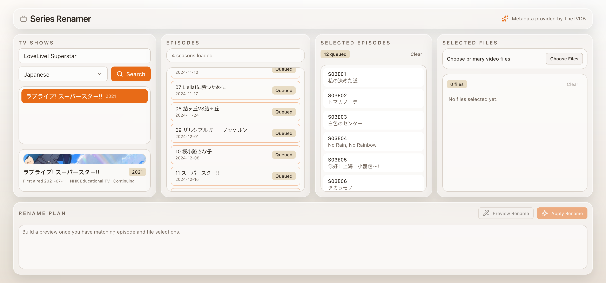

# Series Renamer

Series Renamer is a self-hosted web app for renaming TV episodes on a home NAS. It is designed as an alternative for Rename My TV Series, with a browser UI and Docker-friendly deployment.

It lets you:

- search shows from TheTVDB
- choose the metadata language
- queue episodes in the order you want
- pick video files from your mounted media library
- preview the final filenames before renaming anything
- rename matching subtitle sidecars such as `.en.ass` and `.tc.ass` together with the video file

## Screenshot



## What It Renames

Primary video files are renamed to this format:

```text
S01E02 - Episode Title.mkv
```

If subtitle or related sidecar files share the same base name, they are renamed too. For example:

```text
oldname.mkv
oldname.en.ass
oldname.tc.ass
```

becomes:

```text
S01E02 - Episode Title.mkv
S01E02 - Episode Title.en.ass
S01E02 - Episode Title.tc.ass
```

## Requirements

- a NAS or server that can run Docker
- a mounted media folder that the container can access
- a [TheTVDB API key](https://thetvdb.com/api-information)

## Docker Compose

Create a folder for the app, then add this `docker-compose.yml`:

```yaml
services:
  seriesrenamer:
    image: ghcr.io/mudkipme/seriesrenamer:latest
    container_name: seriesrenamer
    restart: unless-stopped
    ports:
      - "3001:3001"
    environment:
      PORT: 3001
      MEDIA_ROOT: /media
      TVDB_API_KEY: your_thetvdb_api_key
      TVDB_PIN: ""
    volumes:
      - /path/on/your/nas/tv:/media
```

Then start it:

```bash
docker compose up -d
```

Open:

```text
http://YOUR-NAS-IP:3001
```

## Docker Run

If you prefer `docker run`:

```bash
docker run -d \
  --name seriesrenamer \
  --restart unless-stopped \
  -p 3001:3001 \
  -e PORT=3001 \
  -e MEDIA_ROOT=/media \
  -e TVDB_API_KEY=your_thetvdb_api_key \
  -e TVDB_PIN= \
  -v /path/on/your/nas/tv:/media \
  ghcr.io/mudkipme/seriesrenamer:latest
```

## Settings

Environment variables:

- `TVDB_API_KEY`: Required. Your TheTVDB API key.
- `TVDB_PIN`: Optional. Only needed if your TheTVDB account uses a PIN.
- `MEDIA_ROOT`: Path inside the container that should be browsable by the app. In the examples above this is `/media`.
- `PORT`: Web server port inside the container. Default is `3001`.

## How To Use

1. Search for a show in the `TV Shows` panel.
2. Pick the correct series and load its episodes.
3. Select the episodes you want to rename.
4. Open the file picker and choose the matching video files from your media folder.
5. Click `Preview Rename` and review the planned names.
6. Click `Apply Rename` only after the preview looks correct.

The order of the selected episodes matters. Files are matched against the queued episode order.

## Important Notes

- Only folders under the mounted `MEDIA_ROOT` can be browsed and renamed.
- Always preview before applying changes.
- If the selected metadata language does not have some translated episode titles, the app falls back to the default episode data.
- The app is intended for episodic TV libraries, not movies.

## Building From Source

If you want to build the image yourself:

```bash
docker build -t seriesrenamer .
```
